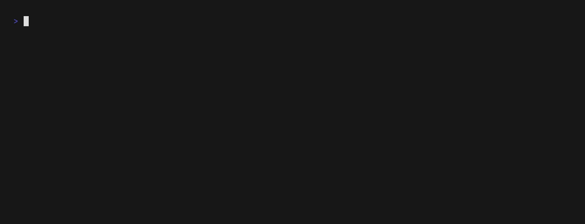

#  Puff - Deluge Torrent Retention Manager

Application for automatic torrent management in Deluge. Removes finished torrents that have exceeded a specified
retention period.



## Description

Puff is a background application that connects to a Deluge client via JSON-RPC
and automatically removes finished torrents according to a configurable retention policy.
The application can run as a cron job scheduler or execute the retention job once and exit.
It can be deployed as a Docker container with a small footprint.

## Features

- 🔄 Automatic removal of finished torrents after retention period
- ⏰ Cron-based job scheduling
- 🏃‍♂️ Run-once execution
- 🧪 Dry-run mode for testing without actual deletion
- 🔐 Authentication via Deluge JSON-RPC API
- 📊 Detailed operation logging
- 🐳 Ready-to-use Docker image
- 💬 Discord notifications for job summaries and errors

## Requirements

- Go 1.25 or newer
- Access to a Deluge instance with WebUI and JSON-RPC API enabled
- (Optional) Docker for containerized deployment

## Configuration

The application is configured via environment variables:

| Variable                     | Description                                                         | Required | Default Value |
|------------------------------|---------------------------------------------------------------------|----------|---------------|
| `PUFF_CRON_SCHEDULE`         | Cron schedule (e.g., `0 0 * * *` for daily at midnight). Required if `PUFF_RUN_ONCE` is `false`. | No       | -             |
| `PUFF_DELUGE_URL`            | URL to Deluge JSON-RPC API (e.g., `http://deluge.lan/json`)         | Yes      | -             |
| `PUFF_DELUGE_PASSWORD`       | Deluge password                                                     | Yes      | -             |
| `PUFF_RUN_ONCE`              | If `true`, the application runs the retention job once and exits.     | No       | `false`       |
| `PUFF_DELUGE_CLIENT_TIMEOUT` | HTTP client timeout. Valid time units: ns, us (or µs), ms, s, m, h. | No       | `2m0s`        |
| `PUFF_RETENTION`             | Retention period in ISO 8601 format (e.g., `P14D` = 14 days)        | No       | `P14D`        |
| `PUFF_START_DELAY`           | Application startup delay                                           | No       | `0s`          |
| `PUFF_DRY_RUN`               | Test mode (does not delete torrents)                                | No       | `false`       |
| `PUFF_LOG_LEVEL`             | Logging level (DEBUG, INFO, WARN, ERROR)                            | No       | `INFO`        |
| `PUFF_DISCORD_WEBHOOK_URL` | Discord webhook URL for notifications                               | No       | -             |
| `TZ`                         | Time zone                                                           | No       | `UTC`         |

### Retention Format

Retention is specified in ISO 8601 period format:

- `P14D` - 14 days
- `P30D` - 30 days
- `P1M` - 1 month
- `P7DT12H` - 7 days and 12 hours

### Cron Schedule Format

Uses standard cron format with 5 or 6 fields:

- `@every 5s` - every 5 seconds
- `0 0 * * *` - daily at midnight
- `0 */6 * * *` - every 6 hours
- `0 0 * * 0` - weekly on Sunday
- `0/10 * * * * *` - every 10 seconds (6 fields, with seconds)

## Usage

### Local Execution

Use [run file](./run.sh)

### Docker Execution

Run with cron schedule:
```bash
docker run -d \
  -e PUFF_CRON_SCHEDULE="0 0 * * *" \
  -e PUFF_DELUGE_URL="http://url_or_ip_to_deluge/json" \
  -e PUFF_DELUGE_PASSWORD="your_password" \
  -e PUFF_RETENTION="P14D" \
  --name puff \
  ghcr.io/lukfisz/puff:latest
```

Run once and exit:
```bash
docker run --rm \
  -e PUFF_RUN_ONCE="true" \
  -e PUFF_DELUGE_URL="http://url_or_ip_to_deluge/json" \
  -e PUFF_DELUGE_PASSWORD="your_password" \
  -e PUFF_RETENTION="P14D" \
  --name puff-run-once \
  ghcr.io/lukfisz/puff:latest
```

### Docker Compose Example

Basic example:

```yaml
services:
  puff:
    image: ghcr.io/lukfisz/puff:latest
    container_name: puff
    environment:
      PUFF_CRON_SCHEDULE: "0 0 * * *"
      PUFF_DELUGE_URL: "http://url_or_ip_to_deluge/json"
      PUFF_DELUGE_PASSWORD: "your_password"
      PUFF_RETENTION: P14D
    restart: unless-stopped
```

Complete example with additional options:

```yaml
services:
  puff:
    image: ghcr.io/lukfisz/puff:latest
    container_name: puff
    environment:
      # Required: Cron schedule for retention job
      - PUFF_CRON_SCHEDULE=0 0 * * *
      # Required: Deluge JSON-RPC API endpoint
      - PUFF_DELUGE_URL=http://deluge.lan/json
      # Required: Deluge password
      - PUFF_DELUGE_PASSWORD=${DELUGE_PASSWORD}
      # Optional: Retention period (default: P14D)
      - PUFF_RETENTION=P14D
      # Optional: Startup delay (default: 0s)
      - PUFF_START_DELAY=5s
      # Optional: HTTP client timeout (default: 2m0s)
      - PUFF_DELUGE_CLIENT_TIMEOUT=2m0s
      # Optional: Dry-run mode (default: false)
      - PUFF_DRY_RUN=false
      # Optional: Logging level (default: INFO)
      - PUFF_LOG_LEVEL=INFO
      # Optional: Discord webhook url (default: "")
      - PUFF_DISCORD_WEBHOOK_URL="https://webhooh.to.your.discord.channel"
      # Optional: Time zone (default: UTC)
      - TZ=Europe/Warsaw
    restart: unless-stopped
    # Optional: Health check
    healthcheck:
      test: [ "CMD", "pgrep", "-f", "puff" ]
      interval: 30s
      timeout: 10s
      retries: 3
      start_period: 10s
```

## How It Works

1. The application connects to Deluge via JSON-RPC API.
2. 
   - If `PUFF_RUN_ONCE` is `true`:
     - The retention job runs immediately once and the application exits.
   - If `PUFF_RUN_ONCE` is `false` (default):
     - Starts a job scheduler according to `PUFF_CRON_SCHEDULE`.
     - In each cycle:
         - Retrieves a list of finished torrents.
         - Filters torrents that have exceeded the retention period (based on `time_since_download`).
         - Removes expired torrents along with their data (if `PUFF_DRY_RUN=false`).
         - Logs operation details, including freed disk space.
         - Sends a notification to Discord (if configured).

## Discord Notifications

Puff can send notifications to a Discord channel using a webhook. This is useful for monitoring the application's status and receiving timely alerts.

Notifications are sent for:
- **Job Summaries**: A summary of the retention job, including the number of removed torrents and the total space freed.
- **Errors**: Any errors or fatal events that occur during the application's execution.

To enable Discord notifications, you need to provide a webhook URL in the `PUFF_DISCORD_WEBHOOK_URL` environment variable. You can get a webhook URL from your Discord server's settings.

## Dry-Run Mode

In dry-run mode, the application only logs which torrents would be removed but does not perform the deletion operation.

## Development

### Project Structure

```
root/
├── Dockerfile           # Docker image
├── run.sh               # Local execution script
├── main/
│   ├── main.go          # Main application file
│   ├── config.go        # Configuration and environment variables
│   ├── cronjob.go       # Job scheduler
│   ├── deluge.go        # Deluge JSON-RPC client
│   ├── discord.go       # Discord client
│   ├── retentionjob.go  # Torrent removal logic
```

## Dependencies

- [gocron](https://github.com/go-co-op/gocron) - GoCron is a job scheduling package which lets you run Go functions periodically at pre-determined times using a simple, human-friendly syntax.
- [envconfig](https://github.com/kelseyhightower/envconfig) - A Go library for managing configuration data from environment variables.
- [log](https://github.com/charmbracelet/log) - A fancy logger for Go with stylish formatting and levels.
- [uuid](https://github.com/google/uuid) - A Go package for working with UUIDs (Universally Unique Identifiers).
- [date](https://github.com/rickb777/date) - A Go package for working with dates, times and ranges.
- [testify](https://github.com/stretchr/testify) - A Go library with tools for testing and assertions.

## License

This project is licensed under the MIT License - see the [LICENSE](LICENSE) file for details.

## Author

lukFisz
